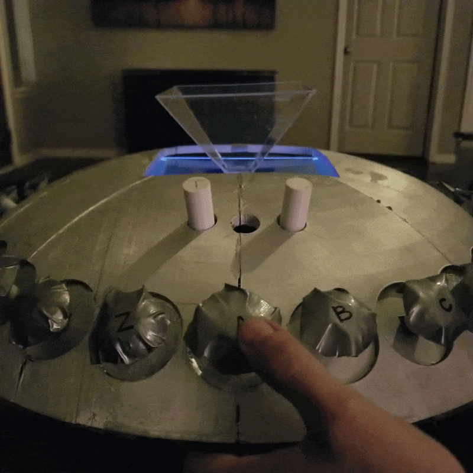
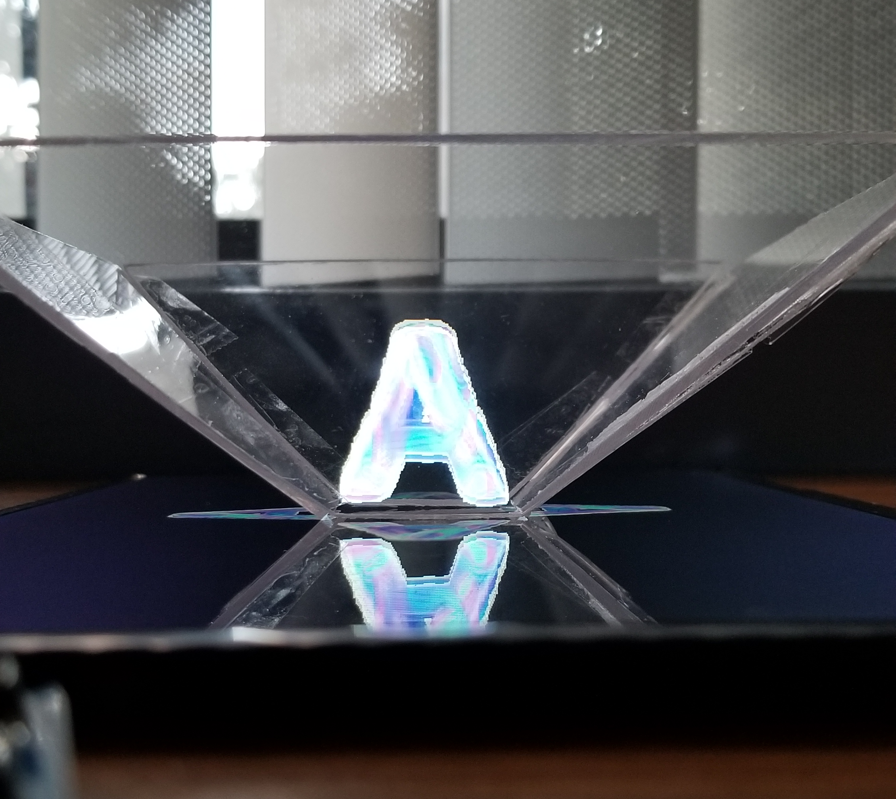

# Senior Capstone — Holographic Educational Toy

Conceived and led development of an interactive alphabet-teaching toy with holographic display. One of five projects selected by peers out of 30 student proposals. Delivered on time with Grade A.

## My Role

**Founder & Project Leader** | Sept–Dec 2020

- Proposed project idea; selected by classmates as one of five teams to deliver
- Led 5-person cross-functional team (2 Hardware, 3 Software) from charter to delivery
- Established team structure, communication norms, and delivery schedule
- Managed budget across 5 team members; delivered within planned estimates
- Adapted to COVID disruptions with twice-weekly online meetings + masked in-person sessions

## What I Delivered

- **Planning**: Created 6 formal project documents (charter, requirements, design, vision/scope, testing, final presentation)
- **Execution**: Coordinated hardware/software integration; completed all milestones on schedule
- **Problem-Solving**: Diagnosed and resolved critical wiring failure near deadline without delaying delivery
- **Tracking**: Maintained weekly team and individual progress reports

## The Result

- Fully functional holographic toy with 26 alphabet buttons, Learning Mode, and Quiz Mode
- Grade: A
- Presented to faculty panel as capstone demonstration (Dec 1, 2020)

## Documentation

| Document | Description |
|----------|-------------|
| [Team Charter](docs/01_team_charter.pdf) | Roles, ground rules, mission |
| [Requirements](docs/02_requirements_specification.pdf) | Use cases, functional requirements |
| [Design](docs/03_design_document.pdf) | Gantt charts, UML, architecture |
| [Vision/Scope/Plan](docs/04_vision_scope_plan.pdf) | SOW, WBS, risk management, schedule |
| [Testing Plan](docs/05_testing_plan.pdf) | Test cases, acceptance criteria |
| [Weekly Reports](docs/Weekly_Reports) | Team and individual progress tracking |

## Visuals

| Exterior | Wiring | Hologram |
|----------|--------|----------|
|  |  |  |